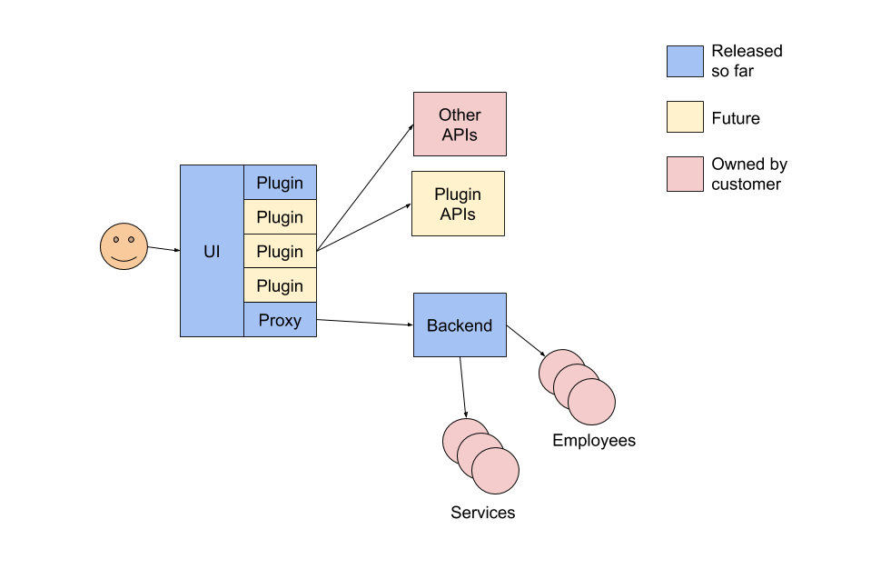
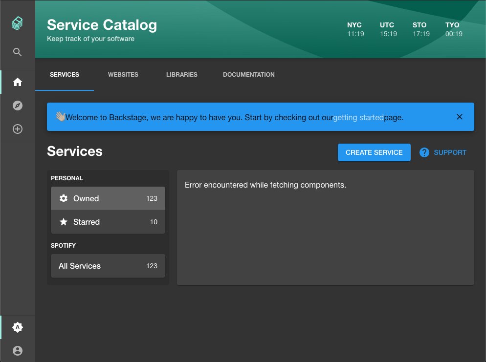
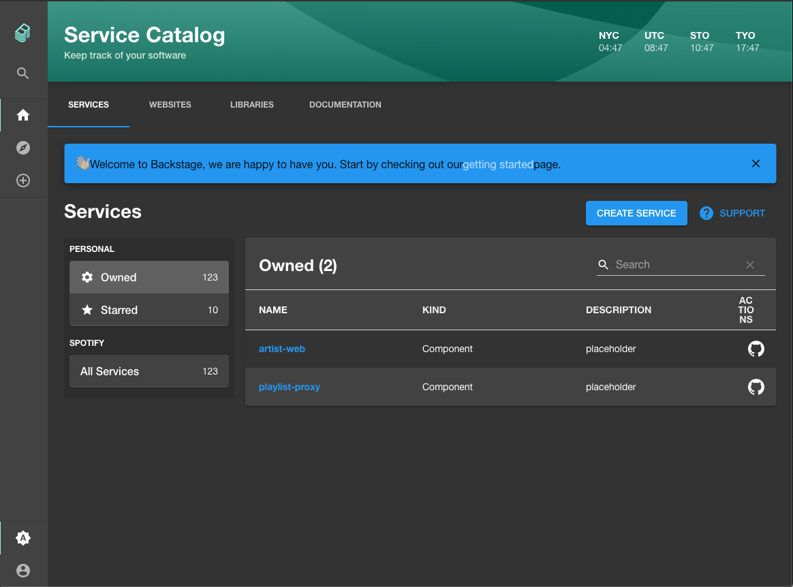

At the time of writing, early June 2020, Backstage is under heavy development. Many features are non-functional and there is no official application packaging which makes it easy to install or use Backstage in a production setup.

I wanted to see what it would take to start up Backstage with the service catalog and backend using Docker Compose so I could figure out the steps to host it on a VM or in Kubernetes.

**This setup is in no way suitable for a production Backstage installation**. It uses development servers and localhost extensively and won't work on a domain name without some severe editing of the Backstage source code. Use at your own risk!

The Backstage architecture looks something like this



The important components for the purposes of this exercise are:

1. The **UI** layer. This is what we are will be referring to as the frontend. Typically it runs on `http://localhost:3000`.
2. The **Proxy**. This accepts certain requests which go to `http://localhost:3000` and forwards them to other places. For example, it forwards any `localhost:3000` request which contains the path `/catalog/` over to `http://localhost:7000`. This is configured in `packages/app/package.json` [[source code](https://github.com/spotify/backstage/blob/f44c609244182df9b877deda6224c78b11f1b170/packages/app/package.json#L68)]. It also handles requests for the CircleCI plugin although we won't be dealing with that in this post.
3. The **Backend**. This is the service catalog. It typically run on `http://localhost:7000`. [[source code](https://github.com/spotify/backstage/tree/f44c609244182df9b877deda6224c78b11f1b170/packages/backend)]

In order to run this setup with Docker Compose, we need to dockerize the UI in a way which preserves the proxy, dockerize the backend, and then connect them all together so they can talk to each other.

## Dockerizing the Frontend

The `Dockerfile` which is included with Backstage [[source code](https://github.com/spotify/backstage/blob/f44c609244182df9b877deda6224c78b11f1b170/Dockerfile)] simply takes compiled JavaScript files from the `packages/app/dist` directory and hosts them behind an Nginx server in the container it creates. This is fine for running the frontend assets in the browser but it is missing the proxy.

To get around this, we're going to create a Docker container which runs the app with `yarn start`, just like you would do in development. 

First, delete the  `Dockerfile` in the Backstage root directory and create a new one with this content:

```dockerfile
# We are going to run a NodeJS process so we need to 
# inherit from node rather than nginx.
FROM node:lts

WORKDIR /usr/src/app
# This is copying a bunch of unnecessary stuff from the root 
# directory into the container but we won't worry about that
# for the purposes of this experiment.
COPY . .
RUN yarn install

# Allow external connections to the webpack dev server.
EXPOSE 3000

CMD ["yarn", "start"]
```

We can build this container now and run it with Docker Compose, but we will hit a problem. The proxy service will attempt to direct frontend traffic destined for the service catalog to `localhost:7000`. Unfortunately, `localhost` is no good for [inter-service communication in docker-compose](https://docs.docker.com/compose/networking/).

Instead, we have to use the hostname provided by Docker. Later on, when we get to the `docker-compose.yml`, we're going to specifically label the frontend `frontend` and the backend `backend`. Before we build the frontend container, we have to instruct the proxy service to send traffic to `http://backend:7000` instead of `http://localhost:7000`.

To do that, open up `packages/app/package.json` and edit the proxy config.

```json
{
  // ... stuff omitted for berevity
  "/catalog/api": {
    // "target" used to be "http://localhost:7000
    "target": "http://backend:7000", // CHANGE THIS LINE
    "changeOrigin": true,
    "pathRewrite": {
      "^/catalog/api/": "/catalog/"
    }
  }
}
```

Eventually, this type of configuration will be possible without manaully modifying the Backstage source code. Configuration features are still in development unfortunately so this will have to do for now.

With that, we can run the Backstage frontend with Docker.

```shell
» docker build . -t spotify/backstage-frontend
» docker run -p 3000:3000 spotify/backstage-frontend
```

Of course, the service catalog doesn't work because we haven't run the backend yet.



## Dockerizing the Backend

Even though the backend source code lives in `packages/backend`, and you would run `yarn start` within that directory to run the backend in development, we need to create a Dockerfile in the root directory of Backstage to dockerize it. 

The backend relies on various node libraries which are not actually present in `packages/backend/package.json` and I ran into dependency problems when attempting to Dockerize from that subdirectory.

Instead, edit the `Dockerfile` again to the following content:

```dockerfile
FROM node:lts

WORKDIR /usr/src/app
COPY . .
RUN yarn install
# This time we have to build the backend.
RUN yarn build

# Change the working directory before executing yarn start
# so that the backend runs instead of the frontend.
WORKDIR /usr/src/app/packages/backend
EXPOSE 7000

CMD ["yarn", "start"]
```

Build it with Docker just like before and we now have a Dockerized Backstage backend.

```shell
» docker build . -t spotify/backstage-backend
```

## Running everything together

Now that we have our two Docker containers built, we just need to hook them up and run them so they can communicate. Here's the `docker-compose.yml` file you need.

```yaml

version: '3'
services:
  frontend:
    # This is the name of the container image we built
    image: spotify/backstage-frontend
    ports:
      - "3000:3000"
    depends_on:
      - backend

  # Here's the label we mentioned earlier. Any requests 
  # to http://backend* will automatically be routed to 
  # this service by Docker Compose.
  backend:
    image: spotify/backstage-backend
    # All these environment variables are required to 
    # allow the JS to run. They can be dummy values.
    environment:
      AUTH_GOOGLE_CLIENT_ID: a
      AUTH_GOOGLE_CLIENT_SECRET: b
      AUTH_GITHUB_CLIENT_ID: c
      AUTH_GITHUB_CLIENT_SECRET: d
      SENTRY_TOKEN: e
    ports:
      - "7000:7000"

```

Stick that in a file, run it with `docker-compose up` and you should be ready to go.


We can now see the service catalog. Of course, we haven't actually put any data into it yet so there are no services listed in the table.

Luckily, the Backstage folk have created a quick solution to this problem. Run this command to put some dummy data in your catalog and refresh the browser.

```shell
» curl -i -H "Content-Type: application/json" -d '{"type":"github","target":"https://github.com/spotify/backstage/blob/master/plugins/catalog-backend/fixtures/two_components.yaml"}' localhost:7000/catalog/locations
```



